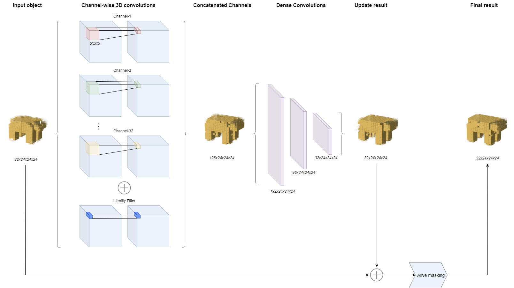
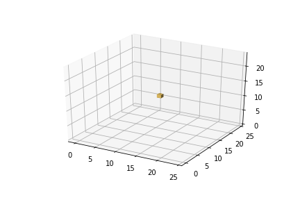
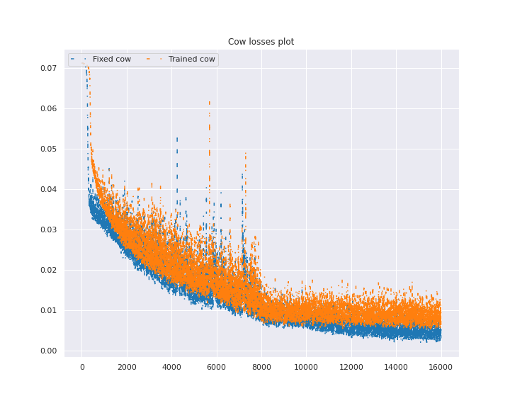
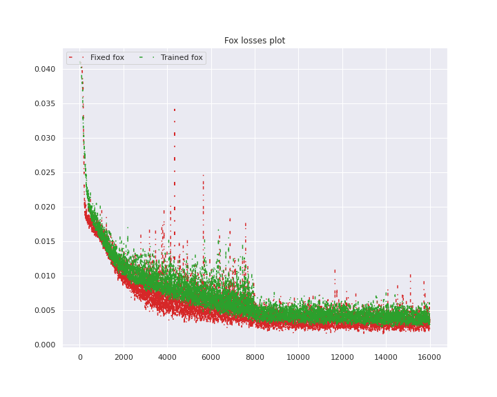

# DLAI_project_3D_NCA
3D neural cellular automaton able to reproduce simple voxels patterns starting from one single cell and learning the underling set of rules.

Follows the model architecture:

## External resources
- <code>binvox_rw.py</code> was taken from [here]( https://github.com/dimatura/binvox-rw-py). 
- The project taken inspiration from [this](https://distill.pub/2020/growing-ca/) link

## Results
Follows the results obtained with the trained models:

## Evaluation results
Follow the plota of losses with fixed and not-fixed perception filter with both objects:

 
